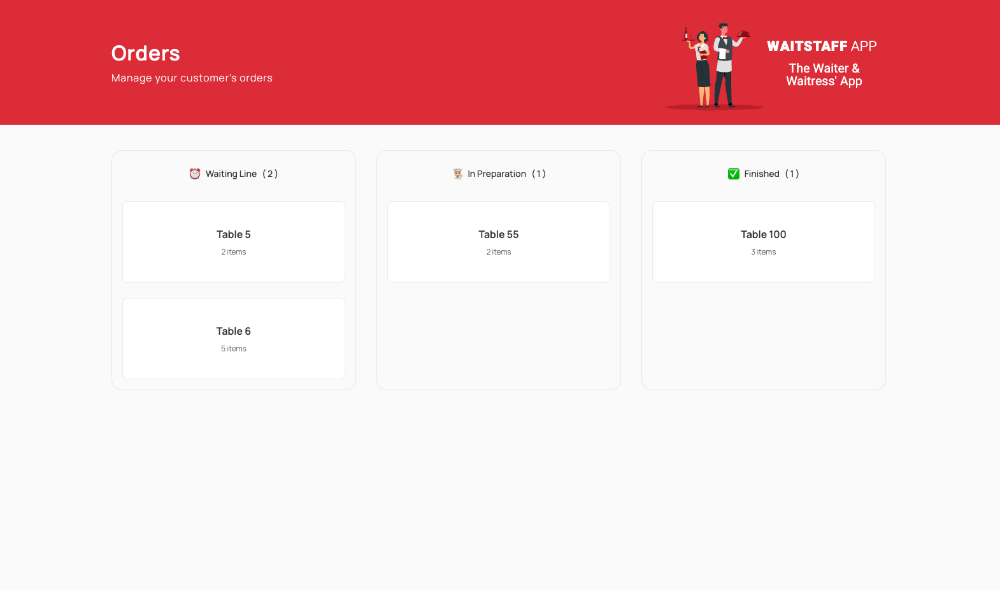
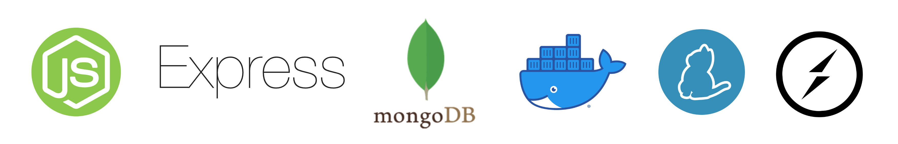

# This is the complete app for Waiters and Waitresses




## WAITSTAFF BACKEND - API
### STACK USED TO BUILD THE PROJECT

<p align-items="center" justify-content="center">
  
</p>

Out backend is built using [Node.js](https://nodejs.org/) with [Express](https://expressjs.com/).

The Database we chose to implement in the Waitstaff app was [Mongo.db](https://www.mongodb.com/) with [Mongoose](https://www.npmjs.com/package/mongoose) as our ODM (Object Data Modelling).

The port we are using for the Database to be running is **27010** and we are using [Docker](https://www.docker.com/) to run it.

We separated the products in the models folder where it contains the categories, the products and also the orders.

In the use cases we separated the items above into folders where we have all the logic there and the logic is tied to the routes that invoke the logic in our use cases files.

In out products we are using images and to handle the upload of the images we are usign [Multer](https://www.npmjs.com/package/multer) which is a Node.js middleware to handle file upload, in our case images. Multer will intercept the request, acting as a middleware.

## TO RUN THE PROJECT

Since we are using [Yarn](https://yarnpkg.com/) as our Package Manager we will run the commands using **yarn**.

- To run in Development mode we use the command:

```javascript
yarn dev
```

The command yarn dev will execute nodemon in the page src and look for the file index.ts

- To run the command to build the project we use:

```javascript
yarn build
```

The command yarn build will execute tsc which means Typescript Compiler that will turn the Typescript code into Javascript to be understood by the browsers.

- To run our backend in Production Mode we will use the command:

```javascript
yarn start
```

This command will execute node and the folder dist which contains the code of our backend/server turned into Javascript

## WAITSTAFF FRONTEND - WEB APPLICATION

<p align-items="center" justify-content="center">
  
</p>

The project was built using [React.js](https://react.dev/) and [Vite](https://vitejs.dev/) with [Yarn](https://yarnpkg.com/) as out package manager.

These are the steps to execute our project:

- To run in Development mode we use the command:

```javascript
yarn dev
```

The command yarn dev will execute vite.

- To run the command to build the project we use:

```javascript
yarn build
```

The command yarn build will execute tsc which means Typescript Compiler that will turn the Typescript code into Javascript to be understood by the browsers.

- To run our backend in Production Mode we will use the command:

```javascript
yarn start
```

This command will execute node and the folder dist which contains the code of our backend/server turned into Javascript


## MOBILE VERSION OF THE WAITSTAFF 

<p align-items="center" justify-content="center">
  
</p>

To build the mobile version of the app we used [React Native](https://reactnative.dev/) and we also used [Expo](https://expo.dev/).
We also used [Yarn](https://yarnpkg.com/) as our package manager.

The command to create the initial boilerplate of the application is:

```javasctipt
yarn create expo-app waitstaff expo-template-blank-typescript
```

In order to run our application in development mode we use the command:

```javasctipt
yarn start
```

The command above will execute expo start and we can use the mobile application in our phone, we just have to scan the QR code provided by Expo
when we run the command yarn start:

After scanning the QR vode we can see the app running live in the phone used and the Phone that scans the code must be using the same internet connection that we are using in the computer.

The only dependencies that we are gonna use throughout the project are: [Styled Components](https://styled-components.com/), [React Native SVG](https://github.com/software-mansion/react-native-svg) and also [Expo Font](https://docs.expo.dev/versions/latest/sdk/font/).

An Observation is that when we install Styled Components in React Native we need the types for Styled Components and also the types for Styled Components React Native:

```javasctipt
yarn add -D @types/styled-components @types/styled-components-react-native
```

and the React Native SVG is gonna be installed using Expo:

```javasctipt
yarn expo install react-native-svg
```
In order to use our custom fonts we will use a dependency called Expo-Fonts:

```javasctipt
yarn expo install expo-font
```

## API COMSUME USING AXIOS

To handle our requests to the backend we are using [Axios](https://axios-http.com/).

The requests to the api are being handled in a file saved in the utils folder named as api.ts.

In this file we abstracted the code that would be repeated across our application that means that we could remove all axios imports because it is being imported only once in the api.ts file.